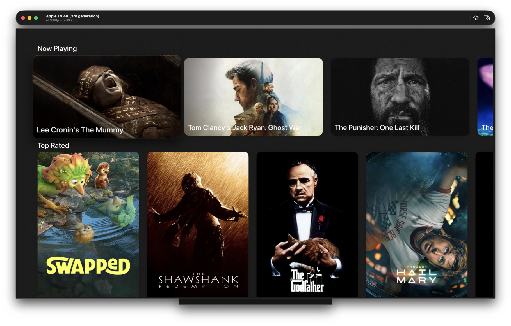

# Movie Catalog (tvOS)

A simple Apple TV (tvOS) application that connects to the TMDB API and presents a catalog of movies.
for Interview purposes

---

## 📱 Features

- Movie listing from TMDB API
- Multiple endpoints support (4 different feeds)
- Pagination support for all endpoints
- Error handling for network and API responses
- Modular and configurable UI structure
- Designed with extensibility in mind (new sections / layouts can be added easily)

## 🚀 How to Run

Before running the project, you need to add the missing configuration file
For security reasons i dont include config files in the Repository

Include your TMBD API key in the provided Production.xcconfig
Copy provided conig file into `/MovieCatalog/Configuration/Files/Production.xcconfig`
> ⚠️ Note: The `Files` directory may be missing in the repository — please create it manually

## 🧱 Architecture

The project is built using a simple **MVVM (Model–View–ViewModel)** architecture. With Flows for each seaction, 
> If the project were to grow beyond a single screen, a **Coordinator pattern** would be introduced for navigation.

- No third-party libraries were used intentionally
- The architecture is designed to be lightweight but scalable
- Networking and UI layers are separated for clarity and extensibility

## 💉 Dependency Injection

- Dependency Injection is implemented manually
- No external libraries were used
- This approach was chosen intentionally due to the small scale of the project

- ## 🌐 Networking

The networking layer is designed to be:
- Scalable
- Reusable
- Easy to extend with new APIs
> Models (**Moview** and **MovieResponse**) mirror the TMDB API response structure directly. They are intentionally kept simple and tightly coupled to the API. For the current scope of this project, I skip the DTO → Domain mapping to avoid unnecessary complexity and boilerplate.

## 🎨 UI Design

The UI layer was designed with flexibility in mind:

- Supports easily adding new sections
- Configurable cover styles
- Designed for future layout experimentation and scaling
- Built with tvOS navigation patterns in mind
